# Quadrat-IPI — the evaluation harness

**Write one class. Get a report for your prompt-injection detector that is comparable, line for
line, with every other detector measured on the same corpus.**

The parts that decide whether two numbers belong in the same table — where the threshold is
chosen, what a detector was allowed to read, what counts as a measurement — are fixed here, in
code, rather than left to whoever writes the adapter. Your adapter says how your detector scores a
document; everything else about the measurement is the same for everyone.

```
python3 -m quadrat.run --list                       # every registered adapter
python3 -m quadrat.run --detector my-detector       # measure yours
python3 -m quadrat.compare --reports                # your detector against the others
```

## Example report

This is what one run produces — a page per detector, rendered from the saved scores. The example is
PIGuard on `v1.0.1` of the corpus; put your own adapter in and the same page comes out for it.

<table>
<tr><td>

<br>
<sub><b>One detector, 92 attack types.</b> Each cell holds its recall at <b>0.1% false positives</b>
on the left and at <b>1%</b> on the right; the last row and column are the marginals. This is the
output, and the point of it: <code>pretext</code> costs this detector 4% where
<code>execution_surface</code> gives 32%, and an average over the grid would have shown neither.</sub>
</td></tr>
</table>

The same page opens with the headline table, and **no line in it is a single number** — every claim
is paired with the operating point it was bought at:

| metric | at 0.1% false positives | at 1% false positives | what it means |
|---|---|---|---|
| recall | 17.4% · CI 16.8–17.9 | 56.9% · CI 56.2–57.7 | share of the injections it caught (16800 unique ones) |
| false positives | 0.102% | 1.002% | how often it flags a clean document — 0.1% is one false alarm per 1000 clean documents, 1% is one per 100 (63000 clean documents) |
| coverage | 2.2% · 2 of 92 | 63.0% · 58 of 92 | in how many of the 92 attack types it catches at least half |
| range over types | 0%–52% | 4%–92% | worst attack type to best — how much the average depends on which types you feed it |
| weakest lever | pretext 4.0% | pretext 32.1% | the construction it handles worst; what is left if the attacker picks it |
| weakest objective | unauthorized_action 6.7% | unauthorized_action 35.1% | the goal it handles worst, same reading |

Read the second column against the first. The same system catches 17% of attacks when a false
alarm costs something and 57% when it does not, and its coverage of the grid goes from 2 cells to
58. "Recall 57%" without the price says nothing about a detector.

Alongside it, false positives per carrier. They are not spread evenly, and a deployment usually
reads one kind of document:

| carrier | FPR | 95% CI |
|---|---|---|
| doc | 0.029% | 0.0–0.1 |
| email | 0.262% | 0.2–0.3 |
| web | 0.014% | 0.0–0.0 |

The page also carries the grid per carrier, the marginals as sorted bars, and your detector against
every other one at a matched false-positive rate.

## Quick start

```bash
uv sync --extra local                        # or: pip install -e '.[local]'
export QUADRAT_OUT=./campaign

# The corpus downloads itself on first use (about 530 MB, once, into the HF cache).
uv run python -m quadrat.run --detector floor      # regex baseline: no model, no GPU
```

That gives you a full report in a couple of minutes, before you have written any code.

### Getting the corpus

Nothing to do: if `QUADRAT_DATA` is unset, the harness downloads
[mihailgribov/quadrat-ipi](https://huggingface.co/datasets/mihailgribov/quadrat-ipi) itself and
caches it.

To keep it as files instead — to grep it, to inspect a row, or to put it on a machine that will not
have network later:

```bash
huggingface-cli download mihailgribov/quadrat-ipi --repo-type dataset \
    --revision v1.0.1 --local-dir quadrat-ipi
export QUADRAT_DATA=quadrat-ipi/data
```

Or in Python, if you only want to look at it:

```python
from datasets import load_dataset
ds = load_dataset("mihailgribov/quadrat-ipi", revision="v1.0.1")
ds["injected"][0]      # a document with an injection in it
ds["clean"][0]         # a document without one
```

**Which version you get.** The harness pins `v1.0.1`, the release it was built and tested against,
rather than following `main`. That is why two people running the same command a year apart get
comparable numbers, and why yours can be put beside the reference table below. Set
`QUADRAT_VERSION=main` to follow the newest state instead.

Every result records the corpus fingerprint it was computed on, so a number can always be traced to
the exact bytes that produced it, whichever copy you fetched.

## Adding your detector

One class, one method. See `detector.py` for the full contract.

```python
from quadrat.detector import Detector, register

@register("my-detector", version="1.2")
class MyDetector(Detector):
    display = "My Detector (v1.2)"      # the product's own name, used in headings

    def setup(self):                    # optional: load weights, warm a connection
        self.model = load_model()

    def score(self, docs):              # REQUIRED: one float per document, in order
        for d in docs:
            yield self.model.predict(d.text)
```

Then `python3 -m quadrat.run --detector my-detector`, and the page above is yours.

`score` returns a **continuous** score, higher meaning more likely an injection. The protocol
needs one: it chooses a threshold at a target false-positive rate, and a verdict cannot be
thresholded. Averaging a verdict yields `(recall + specificity) / 2`, which
looks like an AUC and is not one. A detector that genuinely emits a verdict declares
`binary = True` and is reported at its own operating point, with no curve invented for it.

**The aperture is yours.** `score` is handed whole documents. If your detector has a context
limit, declare `max_chars` and the base class cuts sentence-aligned windows for you and folds them
back by max; or override `score_documents` and split however your product does. The harness will
never impose a window on a detector that did not ask for one — how to read a long document is part
of the detector, and a harness that chunked for everyone would be reporting its own splitter's
recall.

An aperture forced from the command line (`--window`, `--policy`) is recorded as
`forced_aperture` and listed apart from the detector's declared reading, however well it scores:
it answers a question about an integration, not about the detector.

## Evaluation protocol

**One threshold over the whole corpus.** At each operating point the threshold is chosen on all
the clean documents together, never per carrier. A deployment has a single operating point and
does not know whether it is about to read an email, a web page or a report. A per-carrier
threshold hands the detector an oracle it will not have, and flatters whichever detector's
carriers disagree most. The per-carrier false-positive rate is therefore something the report
**measures**, not something it holds fixed.

**Two operating points**, always both: 0.1% false positives (where a document filter is actually
deployed) and 1% (where most published prompt-injection numbers are quoted). They do not rank
detectors the same way, so reporting either alone is a choice about who wins.

**Every score is saved.** `results/<run>.scores.jsonl` holds one score per document, so a new
operating point, a redrawn curve or a re-cut slice costs a second of arithmetic rather than
another pass over the corpus with a model. The scores are the measurement; an operating point is a
reading of it.

**One build only.** Every result records a fingerprint of the corpus it was computed on. Document
ids are positional, so scores from an earlier build describe different documents; results whose
fingerprint does not match are excluded from the tables and listed as stale rather than quietly
mixed in.

### What the numbers mean

| | |
|---|---|
| `recall` | share of the injections caught at that threshold |
| `FPR` | share of clean documents flagged. 0.1% is one false alarm per 1000 |
| `coverage` | in how many of the grid's cells it catches at least half |
| `range` | worst cell to best — how far the average moves if you change the mix |
| `worst lever` / `worst objective` | the construction and the goal it handles worst: what is left when the adversary picks the class |

Worst first, mean last, and that order is the argument. A mean recall is the least informative
number here; the worst end is what an attacker selects and what "protected" has to mean.

### How much of a difference is real

Every rate carries a **Wilson 95% interval**, not a Normal one: at the n of a single cell the
Normal interval runs past 0 and past 1 and is narrowest exactly where it is least trustworthy.

The intervals set what the report is allowed to claim:

* **A cell** rests on tens of examples, so its interval is wide. `0%` on 80 examples means "at
  most about 4.6%", not zero, and the cell grids are meant to be read as pictures rather than as
  numbers.
* **A marginal** — a whole lever or a whole objective — pools an order of magnitude more examples
  than a cell, so those *are* read as numbers. The figures outline margin cells for that reason:
  the tone is the same, the reliability is not.
* **A lead under about 5 points between two detectors in one cell is inside the noise**, and the
  winner grids grey it out instead of declaring a winner.
* **The pooled false-positive rate has a floor.** A threshold selects `score >= tau`, so it can
  never split documents that share a score. If a share of the clean pool sits on one saturated
  value — an fp32 softmax at its ceiling, folded by a max over many windows — every operating
  point below that share is undefined, not merely noisy. `run.py` refuses to publish a point
  under the floor rather than reporting a rate it never reached; see `metrics.score_floor`.

The smallest rate the pool can express at all is `1/n` over the clean documents, which is what
bounds how low an operating point can be measured however good the detector is.

## Reference results

Nine detectors already measured, on the same corpus under the same threshold rule. This is what
your row will sit next to:

| detector | aperture | recall @0.1% | recall @1% | coverage | range | worst lever | worst objective |
|---|---|---|---|---|---|---|---|
| `deepset` | chunks 2000/4 | 1.4% | 7.3% | 0% (92) | 0%–4% | forged_frame 0.9% | execute 0.5% |
| `protectai` | chunks 2000/4 | 3.5% | 14.8% | 0% (92) | 0%–16% | execution_surface 1.4% | execute 0.7% |
| `wolfdefender` | chunks 32768/4 | 10.4% | 27.0% | 0% (92) | 1%–27% | pretext 3.6% | manipulate 6.8% |
| `proventra` | chunks 2000/4 | 15.0% | 42.3% | 0% (92) | 0%–43% | inference 4.4% | execute 5.2% |
| `piguard` | chunks 2000/4 | 17.4% | 56.9% | 2% (92) | 0%–52% | pretext 4.0% | unauthorized_action 6.7% |
| `promptguard` | chunks 2000/4 | 20.8% | 31.4% | 7% (92) | 0%–70% | inference 5.1% | execute 9.6% |
| `bastion` | chunks 2000/4 | **30.2%** | 50.6% | 10% (92) | 5%–60% | pretext 18.6% | manipulate 17.6% |
| `floor` ⚠ binary | whole document | 6.5%† | 6.5%† | 2% (92) | 0%–56% | bare 3.1% | unauthorized_action 0.9% |
| `picket` ⚠ binary | whole document | 12.5%† | 12.5%† | 8% (92) | 0%–76% | bare 5.8% | execute 4.5% |

The ranking is **not the same at the two budgets** — `piguard` is fifth when a false alarm is
expensive and first when it is merely unwelcome — so "X beats Y" without an operating point is not
a statement. `floor` is five regexes for the most quoted injection phrases: not a competitor, but
the line every other number has to be read against, and two systems score below it.

† A binary detector emits a verdict, not a score, so it cannot be moved to a budget; the same pair
is repeated in both columns because it has only one operating point.

<table>
<tr><td>

<br>
<sub>Every thresholded detector across all budgets; the band is the 95% uncertainty area on both
axes. The two binary detectors have no curve — one point each, drawn as a diamond.</sub>
</td></tr>
</table>

**There is no ROC AUC column, on purpose.** Two of the nine emit a verdict rather than a score and
have no curve to integrate, and a full-range AUC is dominated by the region above 1% false
positives, which no deployment of this kind runs in. What the harness ranks by instead is the mean
recall over every budget *below* 1% — the part of the curve that corresponds to a decision somebody
would actually make.

Rendered pages for all nine are in the
[dataset release](https://huggingface.co/datasets/mihailgribov/quadrat-ipi/tree/v1.0.1/reports).

### Putting your detector next to them

The nine were measured once, and the release carries **every score they gave every document**. So
you do not re-run them: fetch their results into your own output directory, and the comparison
page builds itself from yours plus theirs.

```bash
huggingface-cli download mihailgribov/quadrat-ipi --repo-type dataset \
    --revision v1.0.1 --include "results/*" --local-dir ./published

export QUADRAT_OUT=./campaign
mkdir -p "$QUADRAT_OUT/results" && cp published/results/* "$QUADRAT_OUT/results/"

python3 -m quadrat.run --detector my-detector       # only yours actually runs a model
python3 -m quadrat.compare --reports
```

`compare` reads every result in the directory, so your row appears in the same table, at the same
two operating points, against the same corpus. No GPU is spent on anybody else's detector, and
none of their numbers are re-derived by you — they are the published ones.

Two things make this safe rather than convenient. Every result carries the corpus fingerprint it
was computed on, so a downloaded result measured on a different release drops out of the table
instead of being pooled with yours. And the aperture travels with the row, so a detector measured
through 2000-character chunks is never silently compared with one measured on whole documents.

### How the comparison page is built

`python3 -m quadrat.compare` renders that table, and four rules shape it.

**Missing rows are the point.** The roster is built from the adapter registry, not from the
results directory: every registered detector gets a row, and one that was never measured says so,
with the reason, in the same table as the ones that were. What fails to run tends to be the
awkward model, so a table listing only what finished looks like a complete field while quietly
omitting whatever crashed. A reader has to be able to tell "nobody has run this" from
"this scored low".

**Apertures do not mix.** A detector measured through 2000-character chunks and one measured on
whole documents answered different questions, so the aperture is part of a row's identity and is
printed on every line. Where a detector was measured through several, the headline row is the one
that wins over the whole budget interval below 1% FPR — an area rather than a point, because two
apertures often cross and picking by recall at a single budget means whoever picks the budget
picks the winner. The rest are listed under *Other apertures*, and an aperture imposed by a flag
never carries the headline however well it scores.

**Binary detectors are not ranked.** A signature detector has one operating point and cannot be
moved to the target FPR the others were placed at. It appears in every budget column whose rate it
fits, daggered, at its own point — never sorted into a race it is not running.

**Stale rows are named, not dropped.** A result whose corpus fingerprint differs from the current
one cannot be compared with the rest, so it leaves the tables and appears in a list of its own,
with the fingerprint it was measured on.

Removing an adapter is also how a detector is kept out of a release: its runs stop following the
corpus forward, and `rescore` skips them with a reason instead of failing.

## Implementation details

### Layout

The harness, the corpus and the measurements are three artifacts with three lifetimes. Only the
harness lives in this repository; the corpus is published separately, as
[mihailgribov/quadrat-ipi](https://huggingface.co/datasets/mihailgribov/quadrat-ipi) on Hugging
Face, and is not vendored here.

The two have different lifetimes and different licences. The harness is code under one licence and
changes when the protocol changes; the corpus is frozen bytes whose carriers keep the terms of the
sources they came from, and whose identity *is* its content hash. Shipping a copy of the corpus inside the tool would create a second, drifting
one, and a result recorded against "the version that happened to be in your clone" is not a
reproducible result.

| | environment variable | default | what goes there |
|---|---|---|---|
| corpus | `QUADRAT_DATA` | `./data` | `positives.jsonl`, `negatives.jsonl` |
| output | `QUADRAT_OUT` | `./eval-out` | `results/` and `reports/` |

Both are resolved against the directory you run the command from. `--data` and `--results`
override them per command.

### Commands

| | |
|---|---|
| `python3 -m quadrat.run` | measure one detector; writes a result, its scores and a report |
| `python3 -m quadrat.compare` | the cross-detector table; `--reports` also rebuilds every individual report |
| `python3 -m quadrat.rescore` | re-score only the documents that changed and splice them into finished runs |
| `python3 -m quadrat.latency` | per-document latency for one detector |

A long pass checkpoints as it goes and resumes where it stopped: a run over tens of thousands of
documents is hours of a card or dollars of somebody's API, and a crash near the end used to throw
all of it away.

### Re-scoring after an edit to the corpus

A detector here is deterministic and reads one document at a time, and windows are cut inside a
document and never cross into the next. So a document whose bytes did not change produces the same
score it produced before, bit for bit. `rescore` uses that: it re-scores only what changed, splices
the results into the saved scores, and recomputes every metric from the full set — the thresholds
included, because a changed clean document can move the cut and a moved cut changes verdicts on
documents nobody touched. It is the same measurement as a full pass, not a cheaper estimate of one.

### Figures

Every diagram is written to `reports/figures/` as its own SVG file and inserted from there, so one
picture serves the Markdown report and anything else that embeds it — one generator, one set of
bytes, no second drawing that can disagree with the first. `figures.py` builds them.

Two chart types carry almost the whole report, because nearly every question here has the same
shape:

* **bars** — a sorted list of groups with a recall and its interval. Used for every marginal;
  sorted best-first, so the tail of the list is the answer to "where is it blind".
* **heat map of the lever × objective grid** — one per carrier plus the pooled view, so a carrier
  effect reads as the same grid shifting rather than as a single number. The margins of the grid
  *are* the marginals: a row's mean recall is that lever's recall over the same hits and the same
  n, so a separate section would restate it.

Plus, on the comparison page: the ranking bars, the recall-against-budget curve with a 95%
uncertainty band on both axes, and one **winner grid per operating point** — who leads in each
cell, as a single grid rather than one per system, because the claim is about the difference
between them.

Two constraints worth knowing before editing them. The files are loaded through ``, so a
browser parses them as **strict XML**: one unquoted attribute makes the whole figure fail to
render as a broken-image icon, and `check()` parses every file before it is written so that
failure cannot reach a report. And a figure behind `` cannot see the host page's variables,
so **each file carries its own palette**; `auto` bakes in the light values plus a
`prefers-color-scheme: dark` override, `light`/`dark` bake one palette in for a fixed background.

### Slices

Filters over the flat corpus, not separate files, so each caveat is one field a reader can
re-check: `strong`, `obfuscated`, `clean_typo`, `no_pii`. A slice applies to **both**
sides — dropping positives without the matching negatives would compute the false-positive rate
on a pool the recall was not measured on.

`no_pii` is not a research slice but a legal gate: it drops the rows carrying real names of living
people, and any detector reached over someone else's API runs on it.

### Tests

```bash
uv sync --group dev
uv run pytest
```

Nine checks, a couple of seconds, no model and no network: they build a tiny corpus in a temporary
directory and drive the real entry points against it. They cover the parts that break silently —
that the roster can be read without importing anybody's dependencies, that a score is saved for
every document, that recall rises with the budget, that every figure parses as XML, that a missing
corpus is an error rather than a surprise download, and that **the curve passes through the
headline point** (it once did not, and the page showed two protocols at once without looking
wrong).

## Citing

`CITATION.cff` in this repository, and the dataset alongside it — the harness computes, the dataset
is what the numbers are about, and a result is reproducible only when both are pinned:

* harness — <https://github.com/mihail-gribov/quadrat-ipi-eval>
* dataset — <https://huggingface.co/datasets/mihailgribov/quadrat-ipi>, pinned with `revision=`

Every result records the corpus fingerprint it was measured on, so a number can be traced back to
the exact bytes that produced it.
